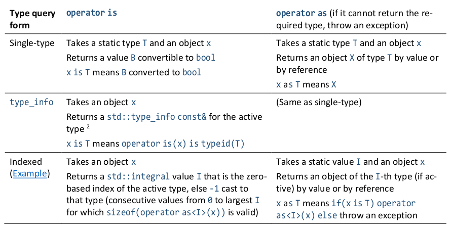
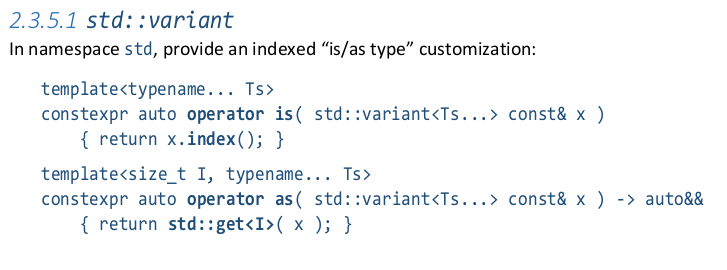
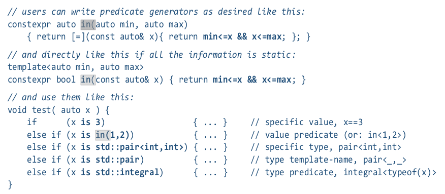
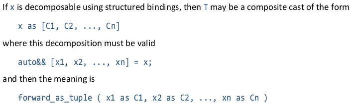
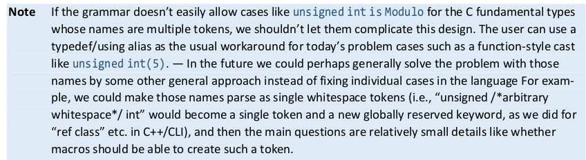

# Pattern matching

Circle build 131 includes an implementation of [P2392R1 - _Pattern matching using `is` and `as`_](http://www.open-std.org/jtc1/sc22/wg21/docs/papers/2021/p2392r1.pdf) by Herb Sutter.

My thanks to Johel Ernesto Guerrero Peña and Michael Park for discussions that helped me understand the semantics of pattern matching.

## Contents

* [Fundamentals of pattern matching](#fundamentals-of-pattern-matching
)
  * [Constraints](#constraints)
  * [Preconditions](#preconditions)
  * [Supporting `std::variant` by extending `is` and `as`](#supporting-stdvariant-by-extending-is-and-as)
  * [Pattern matching on `std::variant`](#pattern-matching-on-stdvariant)
  * [Generic programming](#generic-programming)
  * [Simpler overloads](#simpler-overloads)
  * [Constraints and expressions](#constraint-and-expressions)
* [Bindings and patterns](#bindings-and-patterns)
  * [Designated bindings and patterns](#designated-bindings-and-patterns)
  * [Dereference operator](#dereference-operator)


## Fundamentals of pattern matching

This proposal is big. There's a lot of new syntax. There's a lot of new functionality. There are five major feature domains:
1. _is-expression_ and the overloadable `operator is`.
2. _as-expression_ and the overloadable `operator as`.
3. Structured bindings.
4. Patterns.
5. `inspect` statements and expressions.

[**inspect1.cxx**](inspect1.cxx)
```cpp
#include <concepts>
#include <string_view>
#include <type_traits>
#include <iostream>

// Any even test. You must use a constraint so that errors show up as
// substitution failures.
constexpr bool even(std::integral auto x) {
  return 0 == (x % 2);
}

template<typename type_t>
void f(const type_t& x) {
  std::cout<< type_t.string + ": ";
  
  inspect(x) {
    i is int || i is long || i is long long {
      // Use an inspect-group { }.
      is even => std::cout<< "even signed integral "<< i<< "\n";
      is _    => std::cout<< "odd signed integral "<< i<< "\n";
    }

    i is unsigned || i is unsigned long || i is unsigned long long {
      is even => std::cout<< "even unsigned integral "<< i<< "\n";
      is _    => std::cout<< "odd unsigned integral "<< i<< "\n";
    }

    i is even                     => std::cout<< "even "<< i<< "\n";

    is bool                       => {
      // Use a compound statement as the result.
      if(x) std::cout<< "true!\n";
      else  std::cout<< "false!\n";
    }

    // Any object that compares equal with nullptr. Match nullptr_t, any
    // null-valued pointer type, or any class type with overloaded == that
    // compares true with nullptr.
    is nullptr                    => std::cout<< "nullptr\n";

    // Anything convertible to string.
    s as std::string              => std::cout<< "string "<< s<< "\n";

    i is std::integral            => std::cout<< "integral "<< i<< "\n";

    f is std::is_floating_point_v => std::cout<< "floating point "<< f<< "\n";

    is _                          => std::cout<< "unsupported type\n";
  }
}

int main() {
  f(501ll);    // long long: odd signed integral 501
  f(400u);     // unsigned: even unsigned integral 400
  f('4');      // char: even 4
  f(19i16);    // short: integral 19
  f(true);     // bool: true!
  f(19.1l);    // long double: floating point 19.1
  f("Yo");     // const char*: string Yo
  f(nullptr);  // std::nullptr_t: nullptr
}
```
```
$ circle inspect1.cxx
$ ./inspect1
long long: odd signed integral 501
unsigned: even unsigned integral 400
char: even 4
short: integral 19
bool: true!
long double: floating point 19.1
const char*: string Yo
std::nullptr_t: nullptr
const char*: nullptr
```

The `inspect` statement is a rich context for control-flow programming. It embeds a domain-specific language with new syntax for declaring bindings, tests, conversions, conditionals, sequences, alternatives, groups, and statement and expression results.

In [inspect1.cxx](inspect1.cxx), we specialize the test function `f` over eight different parameter types. The argument of `inspect` is tested against each of the _inspect-clauses_. When entering a clause, it first is tested against a _constraint-sequence_, which is a sequence of `is`, `is not`, `as` and `if` operators. If those tests all pass, the result object initializes one or more _binding declarations_ that are specified on the left-hand side. When the _inspect-clause_ hits the `=>` operator, it executes the listed statement, or returns the listed expression, and exits out of the `inspect` statement.

This DSL includes some conveniences to make your code more expressive. `||` is a mechanism for specifying different inspect alternatives that share a successor.

```cpp
    i is int || i is long || i is long long {
      // Use an inspect-group { }.
      is even => std::cout<< "even signed integral "<< i<< "\n";
      is _    => std::cout<< "odd signed integral "<< i<< "\n";
    }
```

Take these three alternatives individually.
* If the initializer `is int`, then bind the declaration `i` and enter the successor.
* If the initializer `is long`, then bind the declaration `i` and enter the successor.
* If the initializer `is long long`, then bind the declaration `i` and enter the successor.

There are three distinct declarations `i`, with types `int`, `long` and `long long`. However there's just one textual successor. It uses `i`, but the _type_ of `i` depends on which of the alternatives lead to execution of the successor.

The successor is an _inspect-definition_ { }. This is self-similar with the top-level _inspect-definition_ immediately after the `inspect` keyword. It includes a sequence of _inspect-clauses_. If the result statement or expression is reached (i.e, a `=>` token is reached), control flow exits through all the nested definitions and exits the originating _inspect-statement_. If no `=>` token is reached (consider commenting out the `is _` clause here), execution rolls out of the inner _inspect-definition_ and continues execution of the next clause in the parent definition.

### Constraints

```cpp
// Any even test. You must use a constraint so that errors show up as
// substitution failures.
constexpr bool even(std::integral auto x) {
  return 0 == (x % 2);
}

template<typename type_t>
void f(const type_t& x) {
  std::cout<< type_t.string + ": ";
  
  inspect(x) {
    // omitting other inspect-clauses.

    i is even                     => std::cout<< "even "<< i<< "\n";
  }
}
```

The _is-expression_ supports a diversity of left- and right-hand operand types. Inside an _inspect-statement_, the left-hand operand is implicitly the initializer (a reference to a temporary object holding the result object of the expression `x`). `i` is a binding declaration, _not_ an operand. If the _constraint-sequence_ passes, the binding is declared with the constraint's initializer.

The right-hand operand of the _is-expression_ is an overload set containing the function template `even`. Note that `even`'s function parameter is constrained by a C++20 placeholder type specifier `std::integral auto`. If the argument passes the `std::integral` constraint, then the placeholder parameter type `auto` will be that integral type, and the function template may be specialized. If the constraint fails, the `even` function is rejected from the candidate set during overload resolution. _is-expression_ in a dependent context (i.e. a context where either left or right operand is type dependent) allows failure during substitution. In that case, the _is-expression_ will evaluate false. In an _inspect-statement_, the entire _inspect-clause_ will be immediately rejected, effectively striking that alternative from the control flow.

The use of C++20 constraints (or C++11 `std::enable_if`-style constraints if you're a glutton for punishment) is _esssential_ for generic pattern matching programming. Consider what happens without the constraint:

[**constraint.cxx**](constraint.cxx)
```cpp
#include <iostream>

constexpr bool even(auto x) {
  return 0 == (x % 2);
}

template<typename type_t>
void f(const type_t& x) {
  std::cout<< type_t.string + ": ";
  
  inspect(x) {
    // omitting other inspect-clauses.
    i is even                     => std::cout<< "even "<< i<< "\n";
  }
}

int main() {
  f(10);
  f("Hello world");
}
```
```
$ circle constraint.cxx
ODR used by: int main()
constraint.cxx:19:4
  f("Hello world"); 
   ^

ODR used by: void f(const char(&)[12])
constraint.cxx:13:7
    i is even                     => std::cout<< "even "<< i<< "\n"; 
      ^

  instantiation: constraint.cxx:3:29
  during instantiation of function template bool even(const char*)
  template arguments: [
    '0' = const char*
  ]
  constexpr bool even(auto x) { 
                              ^
    error: constraint.cxx:4:18
    left operand must be integral or unscoped enum
      return 0 == (x % 2); 
                     ^
```

We call `f` and pass `10` as an argument. That's fine, no problem. Now we call `f` and pass the string "Hello world". This breaks translation! The call to `even` isn't rejected during overload resolution, because the `const char*` parameter type doesn't violate any constraints. The `f<const char*>` specialization passes overload resolution just fine. But when the compiler's codegen attempts to instantiate the function definition, that fails, because you can't take the modulus of a `const char*`. Since we suffered a failure _outside of a SFINAE context_, the program is ill-formed.

### Preconditions

Generic pattern matching programming requires an extra level of vigilance with respect to constraining interfaces. 

[**string.cxx**](string.cxx)
```cpp
#include <iostream>

template<typename type_t>
void f(const type_t& x) {
  std::cout<< type_t.string + ": "<< std::flush;
  
  inspect(x) {
    // Any object that compares equal with nullptr. This will be nullptr_t
    // or any null-valued pointer type.
    // is nullptr                    => std::cout<< "nullptr\n";

    // Anything convertible to string.
    s as std::string              => std::cout<< "string "<< s<< "\n";

    is _                          => std::cout<< "unsupported type\n";
  }
}

int main() {
  f("Hello world");
  f(nullptr);
}
```
```
$ circle string.cxx
$ ./string
char[12]: string Hello world
std::nullptr_t: terminate called after throwing an instance of 'std::logic_error'
  what():  basic_string::_M_construct null not valid
Aborted (core dumped)
```

Generic pattern matching code quickly exposes defects in the C++ standard library. Consider the _inspect-clause_ that uses the `as std::string` _constraint-sequence_ to convert the `inspect` initializer to `std::string`. If this conversion works, then the binding `s` is declared and initialized with that `std::string` result object, the `=>` token is reached, and the result statement is executed, printing the input to the terminal. 

This works great with the `const char*` parameter type: You'll see "Hello world" printed to the terminal. But what about the `std::nullptr_t` parameter type?

Astonishingly, `std::string` has no constructor that takes a `std::nullptr_t`. Neither does `std::string_view`. These types allow the `std::nullptr_t` to decay to a null-valued `const char*`, and to initialize the string object _to an undefined state!_. In the libstdc++ implementation, `std::string` immediately throws `std::logic_error` and `std::string_view` segfaults. The sane behavior would be for both types to have deleted `std::nullptr_t` constructors (that is pattern-matching friendly, as the _inspect-clause_ would fail during substitution and just be removed as an inspect alternative) and for null-valued character pointers to create zero-length strings and views. Parts of the C++ standard library have easily-violated, non-obvious preconditions that lead to undefined behavior. Implementors should patch these problems, because they're sure to arise more often as pattern matching takes off.

[**string2.cxx**](string2.cxx)
```cpp
#include <iostream>

template<typename type_t>
void f(const type_t& x) {
  std::cout<< type_t.string + ": "<< std::flush;
  
  inspect(x) {
    // Anything convertible to string, except nullptr!
    s is not nullptr as std::string     => std::cout<< "string "<< s<< "\n";

    is _                                => std::cout<< "unsupported type\n";
  }
}

int main() {
  f("Hello world");
  f(nullptr);
}
```
In the [string.cxx](string.cxx) sample, you can uncomment the `is nullptr` clause to guard null-valued initializers. You can even make this check part of the _constraint-sequence_ on the string conversion. [string2.cxx](string2.cxx) demonstrates how this mitigates the problem, but the burden should be on the library to deliver a robust data type, rather than the user to enforce such preconditions.

### Supporting `std::variant` by extending `is` and `as`



[P2392R1](http://www.open-std.org/jtc1/sc22/wg21/docs/papers/2021/p2392r1.pdf) provides extending _is-_ and _as-expression_ with user-defined `operator is` and `operator as` functions. For `operator is` intended to compare an expression against a type (i.e. `x is C` where `x` is an expression and `C` is a type), there are there forms, distinguished by their return types:
1. *Single-type:*  It can return `bool`, indicating the parameter is type `C`.
2. *type_info:* It can return `const std::type_info&`, indicating the object's _dynamic type_ is `C`. This is how you support [`std::any`](https://en.cppreference.com/w/cpp/utility/any). The compiler will compare the returned `type_info` with `typeof(x)`, and yield a `true` or `false` _is-expression_.
3. *Indexed:* It can return a non-`bool` integer. This is how you support sum types like `std::variant`. The index of the active variant member is returned.

Handling of the indexed form is really involved. The compiler frontend calls `operator as` with the same argument, in an unevaluated context, with _indexed_ template arguments, 0, 1, 2, etc. This way it interrogates the sum type for the types of all variant members. `operator as<2>(variant)` is a specialization with the return type of the 2nd variant member. The return types for all variant members are collected, and the compiler emits a switch over the index of the active member, with a case for each variant: the result object is `true` if the variant member has the type originally specified as the template argument of `operator is`, and false if the type matches.



In the proposal, `std::variant`'s indexed `operator is` returns `size_t`, and each indexed specialization of `operator as<I>` returns `std::get<I>(x)`, causing the return type to be deduced as the type of the `I`'th variant member.

This will not work, because of the way the proposal probes variant members. It attemps to call `operator as<I>` with ascending arguments `I` until substitution failure ends the process. At that point, variant alternatives are collected into the bool-yielding switch. But the proposed implementation won't produce a substitution failure when `I` is out of range. If we specialize `operator as<3>` and pass it a three-member `std::variant`, the index is out of range. `std::get<3>` is ill-formed, and raises a compile-time error, inside the function definition, which is outside of a SFINAE context. The entire translation unit breaks during probing.

```cpp
template<size_t I, typename... Ts> requires(I < sizeof...(Ts))
constexpr Ts...[I]& as(std::variant<Ts...>& x) { 
  return std::get<I>(x);
}
```

The indexed form of `operator as` has to be guarded by constraints: use a _requires-clause_ on the template to raise a substitution failure and end the probing of variant alternatives.

Generic pattern matching is _extra generic_, and will require more attention to constraints than ever before: it's important that errors occur on function declarations (like the type declarators or _requires-clauses_) and not in the function definition.

[**inspect2.cxx**](inspect2.cxx)
```cpp
#include <iostream>
#include <concepts>
#include <variant>
#include <any>

// std::variant operator-is support.
template<typename T, typename... Ts>
constexpr bool operator is(const std::variant<Ts...>& x) {
  return holds_alternative<T>(x);
}

template<typename T, typename... Ts>
constexpr T& as(std::variant<Ts...>& x) { 
  return get<T>(x);
}

template<typename T, typename... Ts>
constexpr const T& operator as(const std::variant<Ts...>& x) { 
  return get<T>(x);
}

// std::any operator-is support.
template<typename T>
constexpr bool operator is(const std::any& x) { 
  return typeid(T) == x.type(); 
}

template<typename T> requires (!T.is_reference)
constexpr T operator as(const std::any& x) {
  return any_cast<T>(x);
}

template<typename T> requires (T.is_reference)
constexpr T& operator as(std::any& x) {
  if(auto p = any_cast<T.remove_reference*>(&x))
    return *p;
  throw std::bad_any_cast();
}

// Any even test. You must use a constraint so that errors show up as
// substitution failures.
constexpr bool even(std::integral auto x) {
  return 0 == (x % 2);
}

void f(const auto& x) {
  inspect(x) {
    i as int            => std::cout<< "int "<< i<< "\n";
    i is std::integral {
      is even => std::cout<< "even non-int integral "<< i<< "\n";
      is _    => std::cout<< "odd non-int integral "<< i<< "\n";
    }
    s as std::string    => std::cout<< "string "<< s<< "\n";
    is _                => std::cout<< "((no matching value))\n";
  }
}

int main() {
  std::variant<float, char, int, long, std::string> var;
  var = 5;
  f(var);

  var = 5l;
  f(var);

  std::any any = std::string("Hello any");
  f(any);

  any = 100;
  f(any);
}
```
```
$ circle inspect2.cxx -std=c++20
$ ./inspect2
int 5
((no matching value))
string Hello any
int 100
```

The [inspect2.cxx](inspect2.cxx) sample shows pattern matching on `std::variant`, `std::any`, and tuple types. Structured bindings and patterns are introduced.

We start with the indexed-form of `operator is` and `operator as` to support access to the active member of `std::variant`. To improve compile times, the Circle pack index operator `...[]` specifies the return type at the function declaration, so that we don't have to instantiate the function template's body and deduce the return type, which is slow to compile. The variant's indexed `operator as` uses the _requires-clause_ to raise a substitution failure and terminate probing of variant members.

### Pattern matching on `std::variant`

We start by running an `std::variant` through the _inspect-statement_. The first _inspect-clause_ looks strange:

```cpp
    i is int as int     => std::cout<< "int "<< i<< "\n";
```

Why `i is int as int` and not just `i is int`? This is another situation in which we have to aggressively constrain arguments to support generics in pattern matching. If you call `f(5)`, then `x` is `int` and everything works as expected. `i is int =>` first tests if the argument is `int` (it is), and binds `i` to the initializer, which is type `int`. The result statement can `std::cout<< i`, no problem.

What happens when we pass `std::variant` with an `int` active member? `is int` finds the overloaded `operator is`, which returns the index of the active member. The compiler probes the indexed `operator as` and confirms that, yes, the index of the active member yields an `int` alternative. `is int` evaluates true. The binding `i` is initialized with `x`, which is still type `std::variant`. The result statement `std::cout<< i` tries printing `i`, which has type `std::variant`, breaking the translation unit and generating hundreds of lines of diagnostics: it prints all `operator<<` in standard library, and describes why of them doesn't work.

Although `is int` is true, our expression doesn't behave like an `int`, _because it isn't an_ `int`. It's still a variant. We need a two-step sequence to first constrain, and then convert: 

```cpp
    i is int as int     => std::cout<< "int "<< i<< "\n";
```

`is int` is true on this variant, and then `as int` calls `operator as`, which delegates to `std::get` to return the active member. Now, the binding `i` is initialized with the result of that, so it holds a true `int`, rather than a variant, and the print statement compiles.

### Generic programming 


There is an expectation for pattern matching to work uniformly on any type. Although there is mechanism to deal with any type, it's not as automatic as you may hope. This sample from the proposal suggests that `f` works uniformly for any type, including `variant` and `any`. `i as int` does work for `variant` and `any`, provided their contents are `int`. It will match any other numeric type. If you call `f(10u)`, `i as int` will convert the `unsigned` initializer to `int`, then bind `i` with the converted integer. The same will not happen with `std::variant<unsigned>` or `std::any` holding an `unsigned` value.

`    is std::integral =>`

The next _inspect-clause_ is worse. `variant` and `any` will fail this test, no matter what their active member is. There is no language in the proposal for switching over the active member and applying a constraint. The overloadable `operator is` only exists when the right hand side `C` is an expression or a type, not when it's a concept/constraint.

I think pattern matching needs an additional operator: `^` when used in an _is-expression_ or _as-expression_ right-hand operand, accesses the _active member_ of the left-hand operand.

```cpp
    i as ^int =>
    ^i is ^std::integral => 
```

In the first line, `^` generates a switch for all variant members, and attempts to convert each of them to `int`. If the active member is a type that does not convert to `int`, the _as-expression_ predicate is false and the _inspect-clause_ is dropped during instantiation.

In the second line, `^` generates a switcth for all variant members, and tests each alternative against the `std::integral` constraint. If the active member passes this test, the binding `i` is initialized by unpacking the active member of the initializer. That is, `i` would not be a `variant`, but would be the type of whatever the variant holds. 

If the initializer expression isn't a variant (i.e. doesn't have an indexed form of `operator is`), then `^` is a no-op, and pattern matching does business as usual.

My opinion is that much of the power of the pattern matching proposal is left on the table, by not making available to variant types.

Could we treat variants generically without a special operator? Certainly. Is that too permissive? I don't really know. A special operator creates the distinction between an object and the thing it contains. On the other hand, implicitly generating switches over variant members to capture the power of pattern matching erases this distinction. Maybe it's better, but it is more like the behavior of a dynamic language than C++, the emperor of statically-typed languages.

The story for `std::any` is worse. There's no way to figure out what an `any` holds. It can literally hold anything. Even in theory, there's no way to test the contents of `any` against constraints, against destructure patterns, or really utilize any of the advanced features in the pattern matching proposal. I don't think effort should be spent to support `any`. 

### Simpler overloads

[**inspect3.cxx**](inspect3.cxx)
```cpp
#include <iostream>
#include <concepts>
#include <variant>
#include <any>

// std::variant operator-is support.
template<typename T, typename... Ts>
requires((... || T == Ts))
constexpr bool operator is(const std::variant<Ts...>& x) {
  return holds_alternative<T>(x);
}

template<typename T, typename... Ts>
requires((... || T == Ts))
constexpr T& as(std::variant<Ts...>& x) { 
  return get<T>(x);
}

template<typename T, typename... Ts>
requires((... || T == Ts))
constexpr const T& operator as(const std::variant<Ts...>& x) { 
  return get<T>(x);
}

// std::any operator-is support.
template<typename T>
constexpr bool operator is(const std::any& x) { 
  return typeid(T) == x.type(); 
}

template<typename T> requires (!T.is_reference)
constexpr T operator as(const std::any& x) {
  return any_cast<T>(x);
}

template<typename T> requires (T.is_reference)
constexpr T& operator as(std::any& x) {
  if(auto p = any_cast<T.remove_reference*>(&x))
    return *p;
  throw std::bad_any_cast();
}

// Any even test. You must use a constraint so that errors show up as
// substitution failures.
constexpr bool even(std::integral auto x) {
  return 0 == (x % 2);
}

void f(const auto& x) {
  inspect(x) {
    s as short          => std::cout<< "short<< "<< s<< "\n";
    i as int            => std::cout<< "int "<< i<< "\n";
    i is std::integral {
      is even => std::cout<< "even non-int integral "<< i<< "\n";
      is _    => std::cout<< "odd non-int integral "<< i<< "\n";
    }
    s as std::string    => std::cout<< "string "<< s<< "\n";
    is _                => std::cout<< "((no matching value))\n";
  }
}

int main() {
  std::variant<float, char, int, long, std::string> var;
  var = 5;
  f(var);

  var = 5l;
  f(var);

  std::any any = std::string("Hello any");
  f(any);

  any = 100;
  f(any);
}
```
```
$ circle inspect3.cxx -std=c++20
$ ./inspect3
int 5
((no matching value))
string Hello any
int 100
```

The indexed form of `operator is` and `operator as` allows the compiler to interrogate a user-defined type for its variant members. However, as written, pattern matching never makes any use of this knowledge. There is no advantage to using the indexed form, or the `type_info` form. Always use the `bool`-returning form.

```cpp
template<typename T, typename... Ts>
requires((... || T == Ts))
constexpr bool operator is(const std::variant<Ts...>& x) {
  return holds_alternative<T>(x);
}

template<typename T, typename... Ts>
requires((... || T == Ts))
constexpr T& as(std::variant<Ts...>& x) { 
  return get<T>(x);
}
```

Notice the _requires-clauses_ on the `operator is` and `operator as` function templates. `std::holds_alternative` and `std::get` are each ill-formed when specialized on a type that isn't a variant member of the parameter. We must stave off an error in the function definition by raising a substitution failure in the _requires-clause_ of the function declaration. 

Comment out the constraints and trying building the sample. `as short =>` will specialize `operator is<short>`, and when that definition is instantiated, `holds_alternative<short>` will break, because `short` is not a variant member of its argument.

### Constraints and expressions



C++ practice increasingly delegates logic to lambdas, rather than writing it out in an expression. In this sample from the proposal, `in` is a lambda generator. Call `in` with `min` and `max` values. Those get captured by a closure, which is parameterized on one argument with deduced type. The logic for testing _x-in-range_ is implemented in the body of the lambda. The `in` generator is invoked in an _is-operand_, and the compiler implicitly calls into the lambda when building the _is-expression_.

A problem is that, for generic types `x`, the lambda as written does not work. If `x` is, for instance, a string, `min <= x` will fail during instantiation, leaving the program ill-formed. It's crucial that we fully constrain these helper functions at the declaration, so that they always fail in a SFINAE context, and never during instantiation of the definition.

[**lambda.cxx**](lambda.cxx)
```cpp
#include <iostream>
#include <utility>
#include <concepts>

template<typename A, typename B>
std::ostream& operator<<(std::ostream& os, const std::pair<A, B>& pair) {
  os<< "{ "<< pair.first<< ", "<< pair.second<< " }";
  return os;
}

auto in(const auto& min, const auto& max) {
  // The constraint on the parameter x is requried to prevent
  // an ill-formed definition. A modern C++ idiom is to write the
  // expression three times:
  return [=](const auto& x) 
    noexcept(noexcept(x <= min && x <= max))
    requires(requires{ x <= min && x <= max; }) {
    return min <= x && x <= max;
  };
}

void test(auto x) {
  inspect(x) {
    is 3                   => std::cout<< x<< " is 3\n";
    is in(1, 2)            => std::cout<< x<< " is in(1, 2)\n";
    if (2 < x && x <= 3)   => std::cout<< x<< " is in(2, 3)\n";
    is std::pair<int, int> => std::cout<< x<< " is std::pair<int, int>\n";
    is std::pair           => std::cout<< x<< " is std::pair\n";
    is std::integral       => std::cout<< x<< " is std::integral\n";
  }
}

int main() {
  test(3);
  test(1.5);
  test(std::make_pair(1, 2));
  test(std::make_pair(1.1f, 2.2f));
  test(100);
}
```
```
$ circle lambda.cxx -std=c++20
$ ./lambda 
3 is 3
1.5 is in(1, 2)
2.5 is in(2, 3)
{ 1, 2 } is std::pair<int, int>
{ 1.1, 2.2 } is std::pair
100 is std::integral
```

This sample fixes the code in the proposal by constraining the lambda's parameter. We do this by copying the _entire text of the function_ into a _requires-clause_. Additionally, _the entire text of the function_ is copied into a _noexcept-specifier_ to improve code quality. We've just written the same expression three times.

The "write this function three times" incantation is a real pain in modern C++. Comment out the constraint, recompile, and face the fury of the compiler, as it bludgeons you with error messages.

Writing expressions right in the _is-expression_ operand doesn't have this defect. The _is-operand_ is substituted in a SFINAE context, so a failure there simply rejects that _inspect-constraint_, rather than breaking the build.

The use of an _if-expression_ in a clause provides access to the ordinary C/C++ operators. Should this also be provided for _if-expression_? If the token following `if` is an operator token, should the compiler implicitly provide the initializer as the left-hand operand and evaluate the expression? It is a balancing act. You don't want to create too complex or awkward a syntax. On the other hand, having to write the body of a function three times as an incantation to satisfy the compiler is a real defect with the state of the language today.

Perhaps an abbreviated lambda will be introduced that implicitly includes the constraint and _noexcept-specifier_. 

## Bindings and patterns

[C++17 structured bindings](https://en.cppreference.com/w/cpp/language/structured_binding) have been overhauled by pattern matching, and now may appear in _inspect-statements_. Patterns mimic the form of structured bindings and appear as the right-hand operand of _is-_ and _as-expressions_. 

Bindings and patterns may be recursively constructured. They differ in their terminals. A binding has _declarations_ as terminals. An _is-pattern_ has _is-operands_ as terminals (eg, types, templates, expressions, concepts, variable templates, overload sets, etc). An _as-pattern_ has types as terminals.

* Structured bindings `[ x, y, z ]` - Destructure a tuple-like object (array, vector, matrix, class type with a `tuple_element` partial specialization, or the public non-static data members of any other class type) into its elements.
* Designated bindings `[name1: x, name2: y, name3: z]` - Destructure a class object or vector by its member names. Unlike a C++20 designated initializer, the names can be listed in any order, and you can even have duplicates.
* Wildcard `_` - The underscore `_` is a terminal that matches anything. If you use it in a designated binding or pattern, it checks that the named member exists, but takes no other action.
* Multi `...` - When used by itself, `...` is a multi-element wildcard. It'll consume zero or more elements at substitution. `[a, ..., b]` will bind or test the first and last elements, and ignore all the ones in the middle. You can only have one `...` operator per pattern, although you can nest them without restriction. `[_, ...x]` will bind or test all but the first elements to the binding or pattern `x`.
* Dereference `*` - A non-terminal that adds a compile-time constraint that the element must pass the `Pointer` constraint (i.e. be an actual object pointer, or a class type that overloads `*` and `->`) and a runtime constraint that the pointer is non-null. The runtime constraint means that this cannot be used for a structured binding outside of an _inspect-statement_, but may be used with any other binding or pattern. The element is dereferenced, then passed to the next binding or pattern after the `*` token.

[**pattern.cxx**](pattern.cxx)
```cpp
#include <concepts>
#include <iostream>
#include <tuple>

template<class T, bool V = requires { sizeof(std::tuple_size<T>); }> 
constexpr bool is_tuple_like = V;

// Any even test. You must use a constraint so that errors show up as
// substitution failures.
constexpr bool even(std::integral auto x) {
  return 0 == (x % 2);
}

template<typename T> requires(std::is_class_v<T>)
std::ostream& operator<<(std::ostream& os, const T& obj) {
  if constexpr(is_tuple_like<T>) {
    // Bust the tuple into components and print.
    os<< "[";
    os<< (int... ? ", " : " ")<< obj...[:] ...;
    os<< " ]";

  } else {
    // Use reflection and print non-static public data members.
    os<< "{";
    os<< (int... ? ", " : " ")<< T.member_names<< ":"<< obj...[:] ...;
    os<< " }";
  }
  return os; 
}

template<typename type_t>
void f(const type_t& x) {
  using std::integral, std::cout;

  cout<< x<< ": ";
  inspect(x) {
    [a, b] is [int, int]           => cout<< "2-int tuple "<< a<< " "<< b<< "\n";
    [_, y] is [0, even]            => cout<< "point on y-axis and even y "<< y<< "\n";
    [a, b] is [integral, integral] => cout<< "2-integral tuple "<< a<< " "<< b<< "\n";
    [...pack]                      => (cout<< pack<< " " ...)<< "\n";
    is _                           => cout<< "((no matching value))\n";
  }
}

int main() {
  // Run tuple-like things through the pattern matcher.
  f(std::make_tuple(4, 5));
  f(std::make_pair(0u, 10u));
  f(std::make_pair(5, 10ll));
  f(std::make_tuple(1, 2, 3, 4, 5));

  // Run classes through the pattern matcher.
  struct foo_t {
    long x, y;
  };
  f(foo_t { 10, 16 });

  struct bar_t {
    double a, b, c, d;
  };
  f(bar_t { 5.5, 6.6, 7.7, 8.8 });
}
```
```
$ circle pattern.cxx -std=c++20
$ ./pattern
[ 4, 5 ]: 2-int tuple 4 5
[ 0, 10 ]: point on y-axis and even y 10
[ 5, 10 ]: 2-integral tuple 5 10
[ 1, 2, 3, 4, 5 ]: 1 2 3 4 5 
{ x:10, y:16 }: 2-integral tuple 10 16
{ a:5.5, b:6.6, c:7.7, d:8.8 }: 5.5 6.6 7.7 8.8 
```

The [pattern.cxx](pattern.cxx) sample demonstrates destructure patterns as _is-operands_, and structured bindings as constraint declarations. If the _constraint-sequence_ passes, then the structured binding is initialized, and its declarations made available in the successor.

Bindings and patterns support recursive definitions. The patterns in the same use type operands (`int`), value operands (`0` and `even`) and constraint operands (`integral`).

The `[...pack]` binding serves as a backstop for all structured initializer types: tuple-like classes, arrays, vector, matrices and all other classes match the `[...]` binding. `pack` is a parameter pack declaration, which provides generic access to all of the initializer's elements. `cout<< pack<< " " ...` prints all the pack elements. You can use Circle's static subscript `...[index]` or static slice `...[begin:end:step]` operators effect transformations on pack operands.

### Designated bindings and patterns

[**pattern2.cxx**](pattern2.cxx)
```cpp
#include <string>
#include <iostream>

struct Player { 
  std::string name;
  int hitpoints;
  int coins; 
};

template<typename Player>
void get_hint(const Player& p) {
  std::cout<< p.name<< " -- ";
  inspect(p) {
    is [hitpoints: 1]               => std::cout<< "You're almost destroyed.\n";
    is [hitpoints: 10, coins: 10]   => std::cout<< "I need the hints from you!\n";
    is [coins: 10]                  => std::cout<< "Get more coins!\n";
    is [hitpoints: 10]              => std::cout<< "Get more hitpoints!\n";
    [name: n] {
      if n != "The Bruce Dickenson" => std::cout<< "Get hitpoints and ammo!\n";
      is _                          => std::cout<< "More cowbell!\n";
    }
    is _                            => std::cout<< "You're doing fine.\n";
  }
}

int main() {
  get_hint(Player{ "George Washington", 1000, 500 });
  get_hint(Player{ "Julius Caeser", 1, 1000 });
  get_hint(Player{ "Oliver Twist", 100, 10 });
}
```
```
$ circle pattern2.cxx
$ ./pattern2
George Washington -- Get hitpoints and ammo!
Julius Caeser -- You're almost destroyed.
Oliver Twist -- Get more coins!
```

[pattern2.cxx](pattern2.cxx) ports a sample from [P1317R3 - Pattern Matching](
http://www.open-std.org/jtc1/sc22/wg21/docs/papers/2020/p1371r3.pdf). It demonstrates designated patterns and bindings. While the P2392 flavor of pattern matching generally separates declarations and tests (declarations go on the left inside bindings, tests go to the right inside patterns), bindings do imply static testing. The `[name: n]` binding requires that the initializer object has a data member called `name`, or that constraint with its successors will be dropped.

### Dereference operator


### `operator as` with patterns must use `make_tuple`



```cpp
#include <iostream>
#include <tuple>
#include <cstdio>

struct foo_t {
  int x, y, z;
};

int main() {
  foo_t obj { 1, 2, 3 };
  auto obj2 = obj as [short, long, double];
  std::cout<< obj2...[:]<< "\n" ...;
}
```

With `std::forward_as_tuple`, this will crash at runtime, because the the temporary objects of type `short`, `long` and `double` expire at the end of the full expression. The tuple holds dangling references to them, and when they are used on the next line, the program will load uninitialized memory, and either segfault or just do the wrong thing.

Patterns used as _as-operands_ convert each component and return a tuple built with `std::make_tuple`. This _copies_ the data into a tuple parameterized over those types _by value_, so the data doesn't expire at the end of the full expression.

### Multi-token type names



Circle has extended the expression grammar to support multi-token type names.

[**modulo.cxx**](modulo.cxx)
```cpp
#include <type_traits>

template<typename T>
concept Modulo = requires(T a, T b) { a % b; };

// Use multi-token type names in expressions.
static_assert(unsigned int is Modulo);
static_assert(unsigned int[5] is not Modulo);

// Initialize objects with multi-token type names.
int x = unsigned int(5);
int y = signed long{5};

// Array declarators [] are parsed as part of the type, but &, & and *
// are not. These may be operators!

// Note the void && tokens are not parsed as the type void&&.
template<typename T>
concept small_type = T is not void && sizeof(T) <= 4;
```

You can mix cv-qualifiers and the array declarator `[bounds]` too. However, the tokens `&`, `&&` and `*` are _not_ greedily parsed as part of a type. Doing so would break no existing code, it's likely not what you want. The `small_type` concept has two atomic constraints: first, `T` is not void; second, `sizeof(T) <= 4`. We want `&&` to delimit the constraints, and if that token were parsed greedily, we'd have to wrap the left constraint in parentheses. `&` and `*` likewise have binary operators, and this design favors treating those tokens as operators. However we may greedily consume `[]`, because there is no binary operator `[]`.

### Potentially-throwing `operator as`


